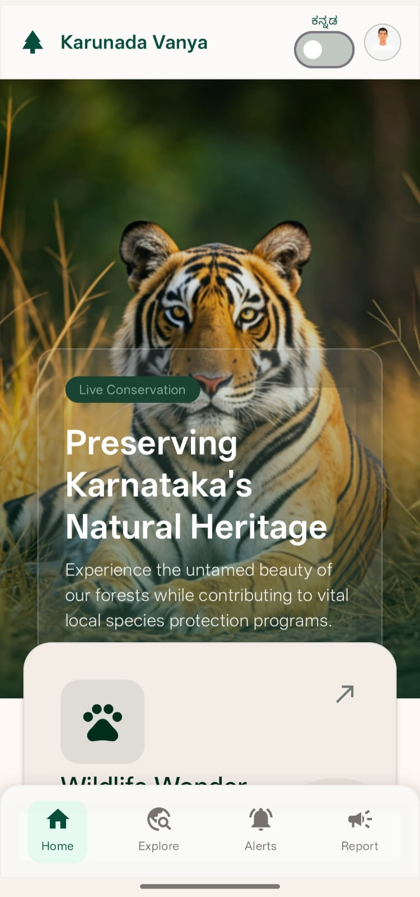
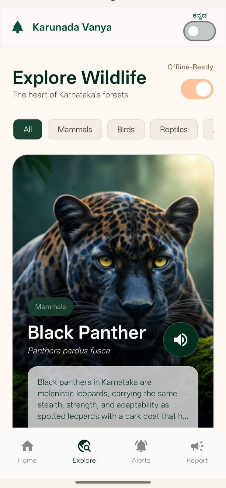
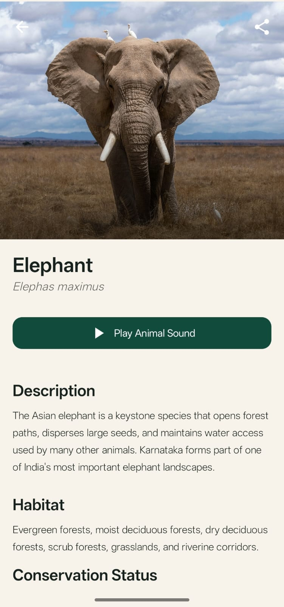
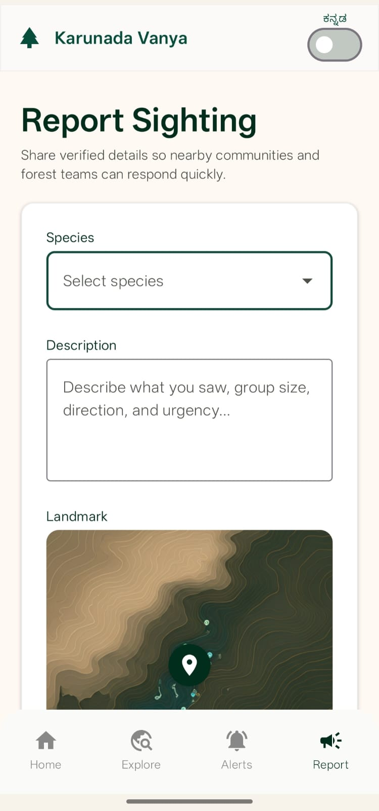
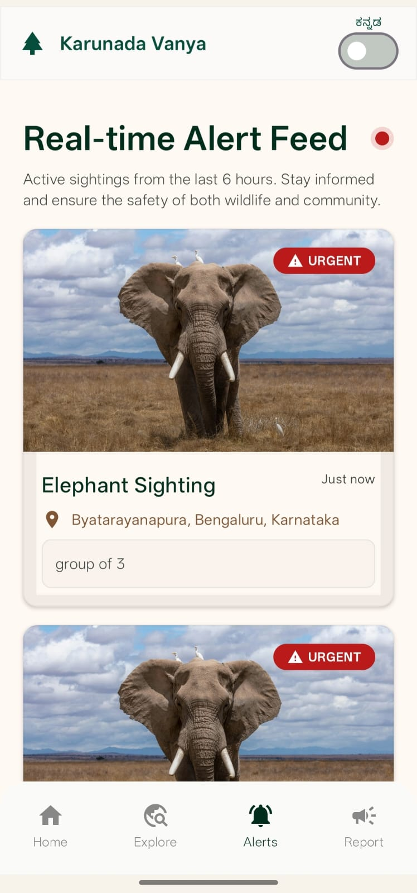
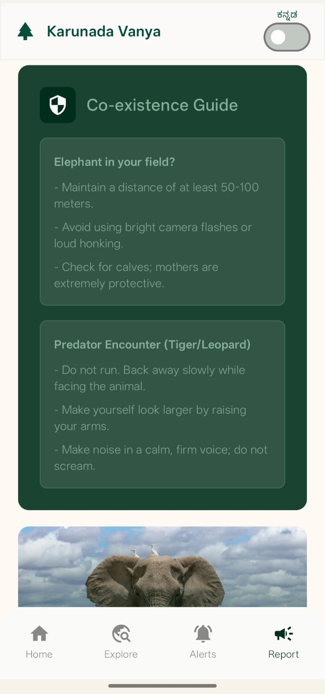
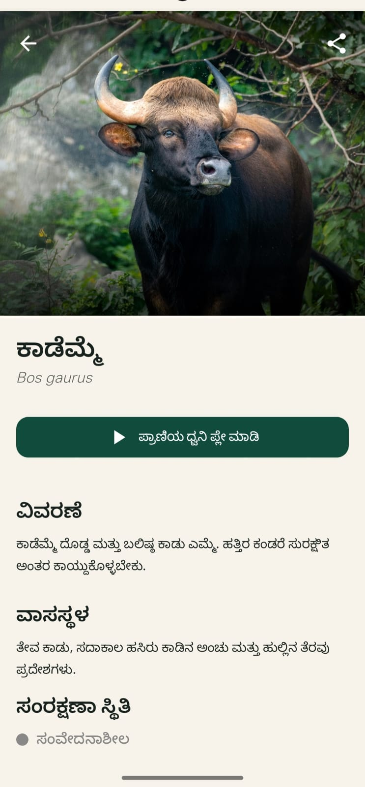

# Karunada Vanya

Karunada Vanya is an Android wildlife education and community alert app focused on Karnataka’s forests. It combines an offline-ready wildlife wiki, forest sound playback, sighting reports, Firebase-backed movement alerts, and safety guidance to promote coexistence between communities and wildlife.

## Project Title

Android App Development using GenAI - Karunada Vanya (National Pride)

## Problem Statement

People living near forest borders often see wildlife such as tigers, elephants, leopards, and other animals as threats. Karunada Vanya is designed to build wildlife pride, improve awareness, and help communities report sightings quickly so nearby people can stay informed and safe.

## Key Features

### Wildlife Wonder

- Offline-ready wildlife and tree information cards.
- Local images from `res/drawable`.
- Local animal sounds from `res/raw`.
- Educational details such as description, habitat, conservation status, locations, and fun facts.
- Includes animals such as Elephant, Tiger, Leopard, Black Panther, Sloth Bear, Wild Boar, Gaur, King Cobra, Hornbill, Peacock, and more.
- Includes tree cards such as Sandalwood, Rosewood, and Teak.
- Trees do not show sound playback buttons.

### Forest Sounds

- Uses Android `MediaPlayer` for local audio playback.
- Sounds are mapped to raw resources such as:
  - `R.raw.elephant`
  - `R.raw.tiger`
  - `R.raw.leopard`
  - `R.raw.sloth_bear`
  - `R.raw.wild_boar`
  - `R.raw.gaur`
- Audio playback releases `MediaPlayer` on completion to avoid audio lockups.

### Community Movement Alerts

- Users can submit wildlife sighting reports.
- Submitted reports create local alerts immediately.
- Alerts are also posted to Firebase for real-time community visibility.
- Alerts remain active for 6 hours to avoid stale information.
- Alerts screen displays active sightings and movement warnings.

### Report Sighting

- Report form includes:
  - Species selection
  - Description
  - Landmark / current location
  - Date and time
- Uses Android location services.
- Uses Geocoder to show readable address information such as locality and sublocality.
- Strict species dropdown for high-threat species:
  - Elephant
  - Tiger
  - Leopard
  - Wild Boar
  - Gaur
  - Sloth Bear

### Safety Guidance

- Co-existence guide for wildlife encounters.
- Safety tips for elephant, tiger, and leopard encounters.
- Emergency and forest support information.
- Community-focused guidelines for safe reporting.

### Multilingual Support

- English and Kannada language support.
- In-app Kannada toggle labeled **ಕನ್ನಡ**.
- The selected language is remembered locally.
- UI text, wildlife information, alerts, report labels, and safety guidance support Kannada display.

## Tech Stack

- Kotlin
- Jetpack Compose
- Material 3
- Room Database
- Hilt Dependency Injection
- Firebase Realtime Database / Firebase alerts
- Google Play Services Location
- Android Geocoder
- MediaPlayer
- Coil for image loading

## Screenshots

### Home Screen


### Explore Wildlife Screen


### Animal Info Screen


### Alert Report Screen


### Alert View Screen


### Guide Screen


### Kannada Language Screen


## Architecture Overview

The app follows a layered structure:

```text
UI Screens
   ↓
ViewModels
   ↓
Repositories
   ↓
Room Database / Firebase / Local Resources


## Open in Android Studio

1. Clone this repository and open it in Android Studio.
2. Let Android Studio sync Gradle.
3. Run the `app` configuration on an emulator or Android phone.
